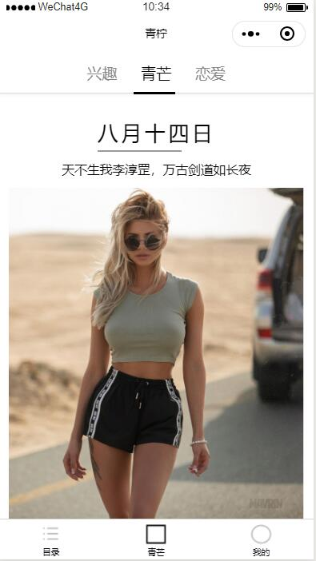
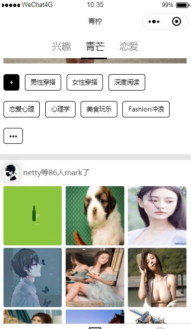
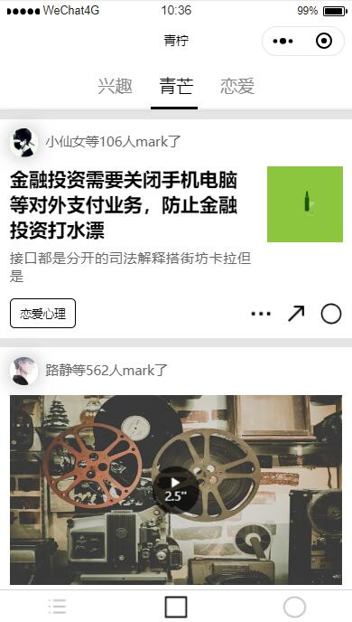
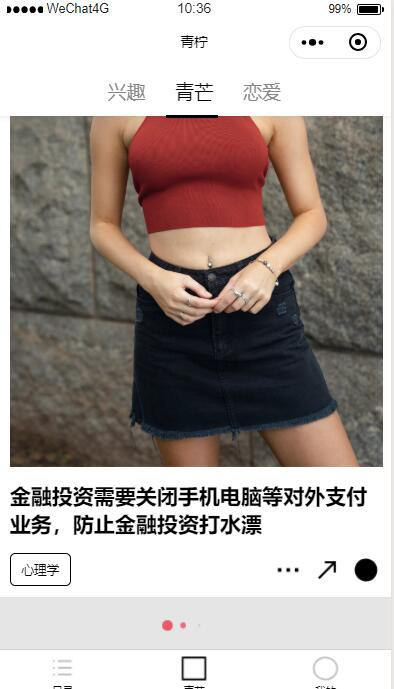
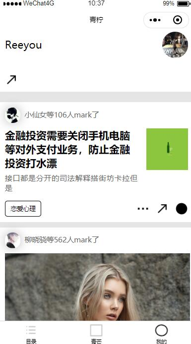
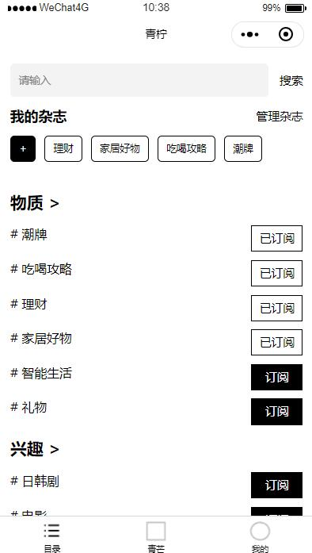
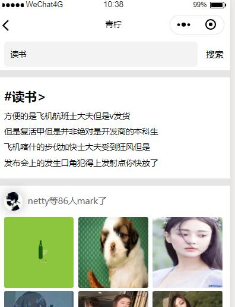

# webapp-magazine
微信小程序-杂志


## 简介
* 基础组件：各个组件需要实现的功能的编写、抽取公共组件
* 数据通信：axios + Yapi
* 组件通信：父子组件通信、监听数据改变
* 目前仅是Yapi模拟接口数据，后面会更新node接口服务、后台管理平台和页面优化等...

## 主要功能
- [x] 首页内容切换展示
- [x] 个人喜欢页
- [x] 文章详情
- [x] 目录订阅内容
- [x] 文章搜素
- [x] 标签类型展示

## 基本目录树
```
├─assets        
├─components   组件库   
│  ├─add
│  ├─article      不同文章类型
│  │  ├─bigImg      大图
│  │  ├─imgText     图文
│  │  ├─nineImg     九图
│  │  ├─pureText    纯文字
│  │  └─video       视频
│  ├─articleList  文章列表
│  ├─behavior     组件属性类型
│  ├─like         喜欢
│  ├─loading      加载
│  ├─more         更多
│  ├─navBar       导航栏
│  ├─recommend    推荐
│  ├─search       搜索
│  ├─share        分享
│  ├─subscribe    订阅
│  └─tagList      标签列表
│      └─tag
├─config
├─pages
│  ├─articleDetail  文章详情页
│  ├─catelog        目录
│  ├─index          首页
│  ├─mine           我的
│  ├─search         搜索
│  └─type           类型
├─service           数据API
│   article.js
│   like.js
│   search.js
│   subscribe.js
├─typings
├─utils               函数封装
│  ├─filter.wxs      
│  ├─format.wxs      
│  ├─randomStr.js    随机字符串 监听数据改变值
│  ├─request.js      请求函数
│  └─tagList.js      标签数据
```
            

**小程序部分截图演示**

#### 主页


#### 标签


#### 文章类型


#### 文章详情


#### 数据加载


#### 我的


#### 目录


#### 搜索



## Build Setup

``` bash
# install dependencies
npm install

# serve with hot reload at localhost:8080
npm run dev

# build for production with minification
npm run build

# build for production and view the bundle analyzer report
npm run build --report
```


